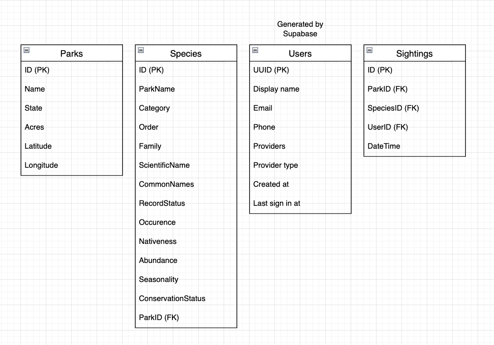

# Purpose

This is an Express API that can serve as a back end to an application that allows users to track wildlife sightings in US National Parks. It uses Supabase for Postgres database and authentication service.

## Security

### Cross Site Scripting (XSS)

The API mainly returns JSON responses and doesn't render HTML, this lowers the cross site scripting risk. For example, the sightings routes send data using the format: res.status(200).send(data). However this alone might not be enough since there isn't sanitization before data is inserted into the database meaning malicious scripts can still be stored in the database and later displayed by the frontend. To fix this, sanitization should happen before data is inserted into the database for example in the POST sightings route Notes field could be sanitized before insertion to make sure no malicious scripts are being stored in the database.

### SQL Injection

The API is mostly protected against SQL injection because we user Supabase instead of raw SQL queries. For example when searching for parks based on ID it is Supabase being called for .from rather than SQL code directly. This means that attackers can't inject SQL commands through request parameters because Supabase is handling the requests internally.

### DDoS

The API doesn't have rate limiting which would serve as mitigation for  DDoS attacks. We could limit each IP address to 100 requests every 10 minutes which would help protect the server from being overwhelmed with fake traffic cause by a DDoS attack. We could also cach common GET requests helping the server during traffic spikes.

### Broken Access Control

The API has some access control protections since the POST sightings route verifies the session token from Supabase before creating a sighting and the getting the authenticated user to prevent users from impersonating other users. There isn't really much access control necessary with the current features the API provides but with added features there will probably need to be added access control security.

### Security Logging and Monitoring Failures

In app.js the API  logs requests using app.use(logger('dev')) however this isn't enough for ecurity monitoring. Logging should be added for failed logins and other suspicious activity. The logging can be used to send alerts and add temporary account lockout if there's too many failed logins.

## Data model

## Features

Any user can make a request to get information about all parks, all species, and all sightings. Authenticated users can make a post request to create a sighting record. Authenticated users can make put or delete requests to update or destroy sighting records that belong to their account.

### Endpoints

#### GET /

Success Response: {data: string}

#### GET /parks

Success Response: {data: { list of park objects }}

Error Response: {message: string}

#### GET /parks/:id

Success Response: {data: { park object }}

Error Response: {message: string}

#### GET /species

Success Response: {data: list of species objects }

Error Response: {message: string}

#### GET /species/:id

Success Response: {data: species object }

Error Response: {message: string}

#### GET /sightings

Success Response: {data: list of sightings objects }

Error Response: {message: string}

#### GET /sightings/:id

Success Response: {data: sighting object }

Error Response: {message: string}

#### POST /sightings

Required params: accessToken, parkID, speciesID

Success Response: {data: sighting object }

Error Response: {message: string}

#### POST /auth/signin

Required params: email, password

Success Response: {data:{session:{token: string, expires_at: integer}}}

Error Response: {message: string}

#### POST /auth/signout

Required params: accessToken

Success Response: {}

Error Response: {message: string}

#### POST /auth/signup

Required params: email, password

Success Response: {data: user object }

Error Response: {message: string}

## TODO

This API is not yet complete. These are the tasks remaining.

1. If you don't yet have a project in Supabase, create one. Start at https://database.new/.
2. Create three tables: Parks, Species, Sightings.
3. Parks and Species tables can be created from the CSV files in the data/ directory here. Be sure to configure the tables correctly with primary keys and foreign key (Species belongs to Park) as well as setting columns to be unique and/or non-nullable as appropriate.
4. The Sightings table should have foreign keys referencing Parks, Species, and auth.User tables, all of which are non-nullable. It should also have a column called date_time that is non-nullable and has a data type of timestamptz.
5. Enable row level security (RLS) on all tables. Policies can be created with templates. Parks and species should have "Enable read access for all users." Sightings should use both "Enable read access for all users" and "Enable insert for authenticated users only."
6. In Supabase, under Authentication -> Sign In / Providers, disable "confirm email" option. This allows for easier testing.
7. In this codebase, fix the "Cannot set headers after they are sent to the client" error.
8. Use the Supabase SDK to implement the route handlers in this codebase so they match the behavior listed in Features above. Remember to do proper error handling and return the correct status codes for each case. Routes/parks.js GET / has been completed as an example of using the Supabase SDK. All necessary files and handlers exist, and each handler has comments with details of what it needs.

For 1 point of extra credit each, you can add:

1. Write better tests. Get at least 80% LOC coverage for parks, species, and sightings route handlers. You can mock the Supabase calls, or leave them as-is and these will be integration tests.
2. Deploy to Vercel. Remember this requires forking the repository to belong to your own Github account.
3. Allow a user to delete a sighting that belongs to them. This will require a new route handler plus a row level security policy on Supabase.
4. Improve the path documentation above so each "object" in successful returns lists all the keys it will hold.

## Development Guide

Automated unit tests are written using Jest and Supertest and live inside the tests/ directory. Run them with `npm test.` Tests should be written for any new features as part of development.

There are some tests right now that don't pass. When the work in TODO is completed, they should pass. They may need minor edits to match the functionality, depending on how you implement validations.

There is a Github workflow configured which will run the test suite on push to any branch and pull request to main branch.

## Resources

 - [Supabase Javascript docs](https://supabase.com/docs/reference/javascript)
 - [Supabase database guide](https://supabase.com/docs/guides/database/overview)
 - [Supabase auth service guide](https://supabase.com/docs/guides/auth)